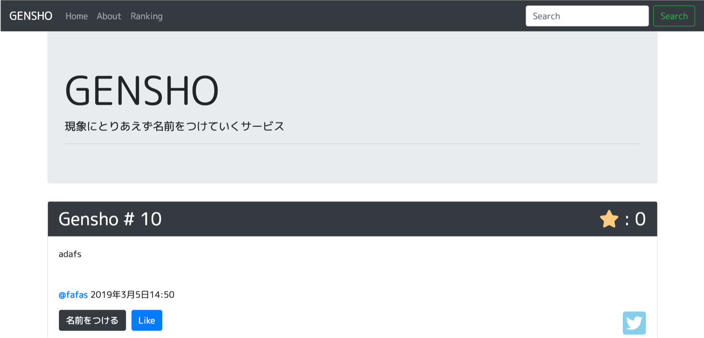

# GENSHO
Simple Django Web Application 「SNSで散見される○○の現象に名前つけたいという要望に勝手に答えていくサービス」



## ライブラリ
- django-social-share
- oauthlib
- PyMySQL (MySQLを使う場合)

## 利用方法

- DjangoWeb/settings.pyの79行目以降のDatabase設定は自身のものに変更すること．

- manage.pyのある階層でtwitter_conf.pyを作成し，以下を書く．

```
CONSUMER_KEY = ""
CONSUMER_SECRET = ""
ACCESS_TOKEN = ""
ACCESS_TOKEN_SECRET = ""
```

- ero.txtには投稿されたくないワードを指定する．

```
ngword1
ngword2
...
```

- もしTwitterにシェアするボタンを表示したい場合はdjango-social-share内のファイルを編集する．

/python3.6/site-packages/django_social_share/templates/django_social_share/templatetags/post_to_twitter.html

```
<div class="tweet-this">
    <a href="{{ tweet_url }}" class="meta-act-link meta-tweet" target="_blank"><i class="fab fa-twitter-square fa-3x my-skyblue"></i></a>
</div>

```

- Twitterから投稿を取得してsaveするプログラムはpost_test.py
